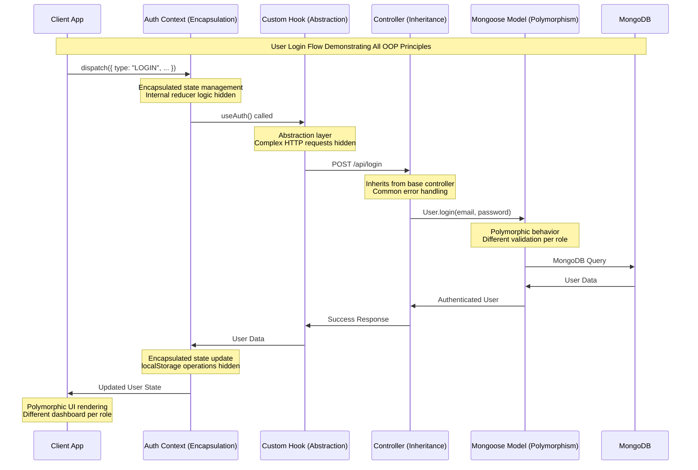
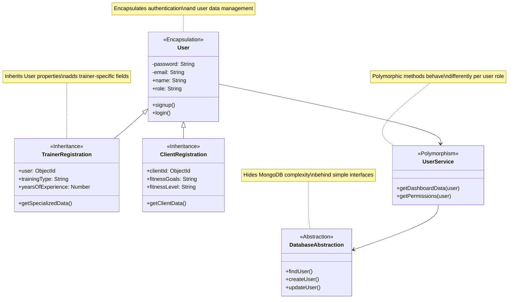

# GymHub System Architecture - OOP Concepts Visual Overview

```mermaid
graph TB
    subgraph "ENCAPSULATION 🔒"
        User[User Model]
        User --> UserData[Private: password, email<br/>Public: name, role]
        User --> UserMethods[Methods: signup(), login()]
        
        Equipment[Equipment Model]
        Equipment --> EquipmentData[Private: maintenance status<br/>Public: name, condition]
        Equipment --> EquipmentMethods[Methods: updateMaintenanceStatus()]
        
        AuthContext[Auth Context]
        AuthContext --> AuthState[Private: reducer logic<br/>Public: user state]
        AuthContext --> AuthActions[Methods: dispatch()]
    end
    
    subgraph "INHERITANCE 🧬"
        BaseUser[Base User Schema]
        BaseUser --> TrainerReg[Trainer Registration<br/>+ training type<br/>+ experience]
        BaseUser --> ClientReg[Client Registration<br/>+ fitness goals<br/>+ medical info]
        BaseUser --> GymOwner[Gym Owner<br/>+ gym management<br/>+ equipment]
        
        BaseModal[Base Modal Component]
        BaseModal --> ReplyModal[Reply Modal<br/>+ textarea<br/>+ reply actions]
        BaseModal --> DeleteModal[Delete Modal<br/>+ confirmation<br/>+ delete actions]
    end
    
    subgraph "ABSTRACTION 🎭"
        Database[(MongoDB)]
        Database --> Mongoose[Mongoose ODM]
        Mongoose --> SimpleAPI[Simple Model API<br/>User.create()<br/>User.findById()]
        
        HTTPRequests[HTTP Complexity]
        HTTPRequests --> CustomHooks[Custom Hooks<br/>useGym()<br/>useAuth()]
        CustomHooks --> ComponentAPI[Simple Component API<br/>registerGym()<br/>login()]
        
        ComplexUI[Complex UI Logic]
        ComplexUI --> UIComponents[Reusable Components<br/>Navbar<br/>Modal]
        UIComponents --> SimpleUsage[Simple Component Usage<br/><Navbar/><br/><Modal/>]
    end
    
    subgraph "POLYMORPHISM 🎪"
        UserInterface[User Interface]
        UserInterface --> ClientBehavior[Client Behavior<br/>Dashboard: bookings, progress]
        UserInterface --> GymOwnerBehavior[Gym Owner Behavior<br/>Dashboard: gyms, equipment]
        UserInterface --> TrainerBehavior[Trainer Behavior<br/>Dashboard: sessions, clients]
        UserInterface --> AdminBehavior[Admin Behavior<br/>Dashboard: approvals, users]
        
        EquipmentInterface[Equipment Interface]
        EquipmentInterface --> InventoryActions[In Inventory<br/>assign_to_gym]
        EquipmentInterface --> GymActions[In Gym<br/>remove_from_gym]
        
        ModalInterface[Modal Interface]
        ModalInterface --> DeleteType[type="delete"]
        ModalInterface --> ReplyType[type="reply"]
        ModalInterface --> InfoType[type="info"]
    end
    
    style User fill:#e1f5fe
    style Equipment fill:#e1f5fe
    style AuthContext fill:#e1f5fe
    
    style BaseUser fill:#f3e5f5
    style BaseModal fill:#f3e5f5
    
    style Mongoose fill:#e8f5e8
    style CustomHooks fill:#e8f5e8
    style UIComponents fill:#e8f5e8
    
    style UserInterface fill:#fff3e0
    style EquipmentInterface fill:#fff3e0
    style ModalInterface fill:#fff3e0
```

## OOP Principles Flow in GymHub



## Component Interaction Example

